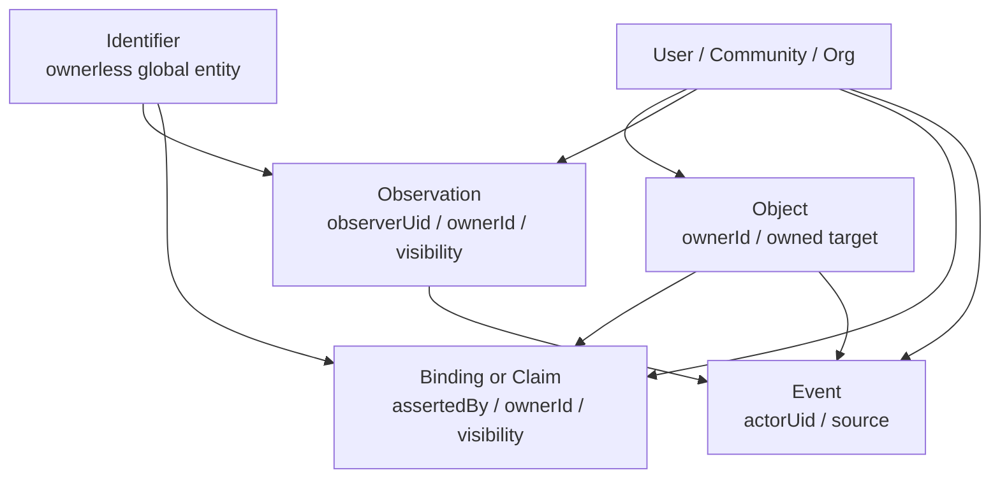
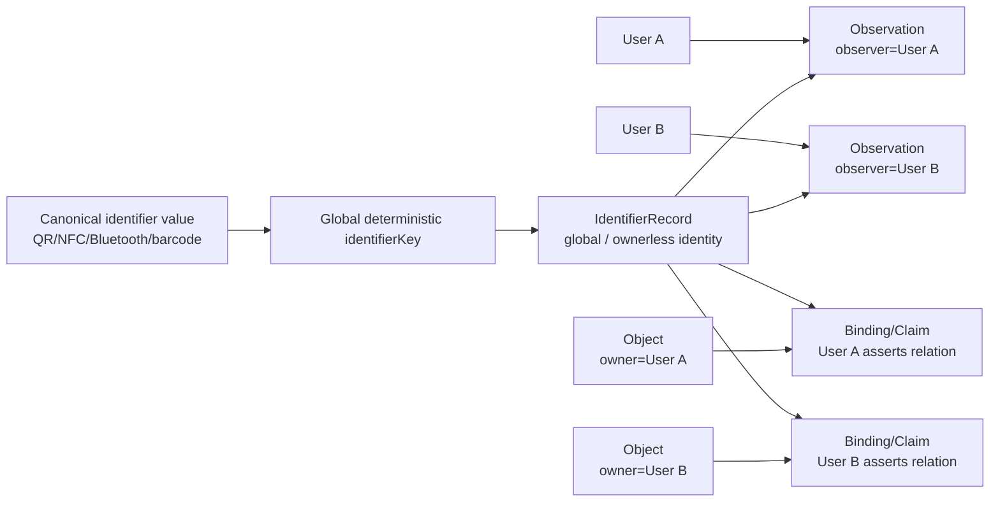

# Ownerless Global Identifier Model

## Scope

This document defines the conceptual data model in which identifiers are global/ownerless entities.

It covers:

* identifiers
* objects
* observations
* object/target bindings
* claims/assertions
* visibility/access control
* legacy `items.tagType`
* legacy `items.bluetoothTags`
* Bluetooth tag identity
* future Wi-Fi/BLE/gateway/sensor identifiers

This is a design/documentation document.
It does not mean runtime schema has already changed.
Current implementation still has `IdentifierRecord.ownerId`.
Future implementation requires a separate schema/rules/migration phase.
Phase 7E remains blocked.

## Adopted conceptual decisions

* Identifier identity is global and ownerless.
* Objects may have owners.
* Observations have observers and may have owner/visibility context.
* Bindings or claims express a relationship between an identifier and a target.
* Bindings/claims may have asserting users, owners, confidence, status, and visibility.
* Identifier observations record who observed what, when, where, and with what metadata.
* `ownerId` belongs to owner-specific records such as objects, observations, bindings, claims, access-control records, and migration provenance.
* `ownerId` should not be part of identifier identity.
* `objectId` should not be part of identifier identity.
* `legacyItemId` should not be part of identifier identity.
* `tagType` is preserved as object legacy metadata.
* `tagType` alone must not create identifiers.
* `bluetoothTags[].id` maps to a global Bluetooth identifier.
* RSSI belongs to observation metadata.
* `linkedAt` is a candidate timestamp for bindings/events.

## Conceptual distinction

| Concept         |                                Has owner? | Meaning                                                                                                       |
| --------------- | ----------------------------------------: | ------------------------------------------------------------------------------------------------------------- |
| Identifier      |                                        No | A globally referable symbol/tag/signal source, such as QR token, NFC UID, barcode value, or Bluetooth tag ID. |
| Object          |                                       Yes | A managed physical/logical asset owned by a user/community/org.                                               |
| Observation     |         Has observer / visibility context | Evidence that an identifier was observed at a time/place by a user/device/system.                             |
| Binding / Claim | Has asserter / owner / visibility context | A statement that an identifier is related to an object/location/container/group/gateway.                      |
| Event           |                  Has actor/source context | Operational history or audit record.                                                                          |

## Current implementation caveat

* Current `IdentifierRecord` includes `ownerId`.
* Current `IdentifierRecord` also has optional `objectId`.
* This is not aligned with the ownerless global identifier conceptual model.
* Do not change runtime types in this task.
* Future work must choose a migration-compatible implementation path.

### Implementation options

Option A:
Reinterpret existing `IdentifierRecord.ownerId` as `createdBy` / `registeredBy` for ownerless identifiers.

Option B:
Introduce a new global identifier registry collection and keep existing `identifiers` as legacy or owner-scoped records during transition.

Option C:
Refactor `identifiers` into ownerless global records and move owner-specific state into observations, bindings, and claims.

Option D:
Keep QR/NFC/manual/barcode identifiers owner-scoped for compatibility but make Bluetooth/radio identifiers global. Mark this as less conceptually clean.

## Mermaid: conceptual ownership separation



## Mermaid: global identifier with multiple users



* global identifier accessibility does not automatically imply public observation history.
* visibility/access policy must be designed separately.
* one global identifier can participate in multiple user/community claims.

## Legacy mapping implications

| Legacy field                     | Target / interpretation                                      | Decision                           |
| -------------------------------- | ------------------------------------------------------------ | ---------------------------------- |
| `items.tagType`                  | `ObjectRecord.legacy.tagType.rawValue` and normalized value  | Preserve                           |
| `items.bluetoothTags[]`          | source array for Bluetooth identifier candidates             | Preserve/migrate                   |
| `items.bluetoothTags[].id`       | global Bluetooth identifier raw/canonical value              | Migrate                            |
| `items.bluetoothTags[].name`     | global Bluetooth identifier label candidate                  | Migrate                            |
| `items.bluetoothTags[].rssi`     | observation metadata candidate                               | Do not store on identifier         |
| `items.bluetoothTags[].linkedAt` | binding/event timestamp candidate                            | Preserve/use as candidate          |
| `items.ownerId`                  | object/binding/observation/provenance/access-control context | Do not use for identifier identity |
| legacy item document ID          | migration provenance / binding context                       | Do not use for identifier identity |

### tagType preservation rules

* `tagType` is legacy object-level metadata.
* Preserve it as raw and normalized legacy metadata.
* `tagType` alone must not create `IdentifierRecord` documents.
* `tagType = "nfc"` does not imply that an NFC UID or NFC identifier value exists.
* `tagType = "qr"` does not by itself prove the existence of a QR identifier unless the QR token/value is otherwise available or derivable under an approved rule.
* `tagType = "none"` should be preserved, not treated as an error.
* Unknown or unexpected `tagType` values should be preserved as raw values and normalized to `unknown` or equivalent, rather than discarded.
* If `tagType` conflicts with actual available identifier data (e.g., `tagType = "nfc"` but `bluetoothTags[]` exists), the dry-run should report a semantic warning rather than silently choosing one interpretation.
* `tagType` must not be added to `identifierSummary.activeKinds` unless there is an actual migrated/active identifier of that kind.

## Deterministic identifier identity

Identifier deterministic identity should be based on:

* `kind`
* `scheme`
* `canonicalValue`
* relevant app/schema namespace metadata

It should not be based on:

* ownerId
* objectId
* legacyItemId
* observerUid
* binding target

```json
{
  "app": "scan.moukaeritai.work",
  "idKind": "identifier",
  "idPurpose": "legacy-bluetooth-tag",
  "kind": "bluetooth",
  "scheme": "bluetooth-legacy-tag-id",
  "schemaVersion": 1,
  "migration": "observation-model-migration",
  "migrationPhase": "phase-7d3",
  "baseline": "tag-1.0.0",
  "sourceCollection": "items",
  "bluetoothTagCanonicalValue": "<canonicalizedBluetoothTagId>"
}
```

## Access and visibility questions

* Are global `IdentifierRecord` documents public to all signed-in users?
* Are raw/canonical values visible or redacted?
* How are observation visibility and community sharing represented?
* Can a user bind an identifier observed by someone else to their own object?
* Do bindings require claims, confidence, moderation, or conflict status?
* How are spoofed/reused Bluetooth IDs handled?
* How are Wi-Fi/BLE/radio identifiers protected from location inference misuse?

## Required future implementation work

* choose implementation path for current `IdentifierRecord.ownerId`
* design global identifier read/write rules
* design claim/binding model
* design observation visibility model
* update TypeScript schema in a later explicit phase
* update Firestore rules in a later explicit phase
* update `firebase-blueprint.json` in a later explicit phase
* implement read-only Bluetooth legacy dry-run
* classify all source fields before execution
* keep Phase 7E blocked until completeness gates pass