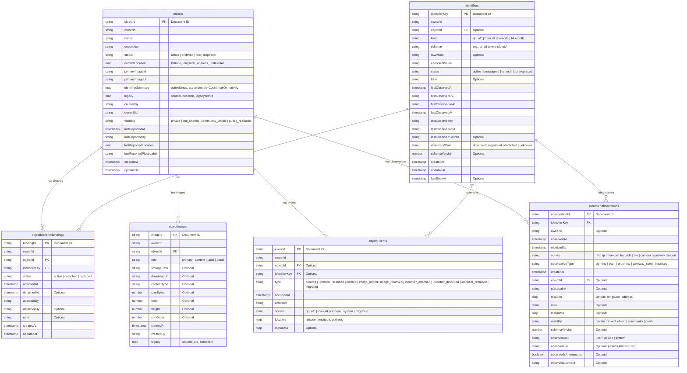

# Data Model Entity-Relationship Diagram

This document provides a comprehensive overview of the normalized data model used in this application. The schema is designed for Firebase Firestore, representing physical objects, their identifiers (like QR or NFC tags), media, and historical events.

## Mermaid ER Diagram

## Collections Description

- **`objects`**: Represents physical items being tracked. Contains descriptive data and summaries of identifiers.
- **`identifiers`**: Represents physical tags (like QR codes, NFC chips) that can be attached to objects.
- **`objectIdentifierBindings`**: Represents the active or historical canonical relationship between an object and an identifier.
- **`objectEvents`**: An append-only audit log recording operational history and events for objects and identifiers.
- **`objectImages`**: Represents media (images) associated with an object, including storage paths and metadata.
- **`identifierObservations`**: Represents loose evidence or records of an identifier being seen or scanned, which may exist before an object is registered or independently of canonical state.
